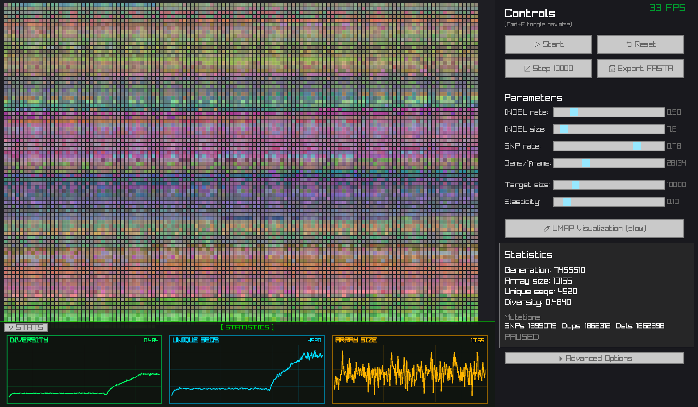

# CenSim

Interactive centromere evolution simulator. Watch satellite repeats mutate, duplicate, and delete in real-time.



## What is this?

Centromeres are regions of chromosomes made up of thousands of tandemly repeated DNA sequences. They evolve surprisingly fast through duplications, deletions, and point mutations. This simulator lets you watch that process happen.

Each colored tile represents a 178bp repeat unit. Similar sequences get similar colors, so you can see evolutionary patterns emerge as the array changes.

## Download

**macOS:** [CenSim.dmg](https://github.com/mbeavitt/censim-interactive/releases/latest/download/CenSim.dmg)

**Linux:** [CenSim-x86_64.AppImage](https://github.com/mbeavitt/censim-interactive/releases/latest/download/CenSim-x86_64.AppImage)

## Building from source

Requires raylib 5.x and premake5:

```bash
# macOS
brew install raylib premake

# Generate makefiles and build
premake5 gmake2
make -C build config=release

# Run
./bin/Release/censim
```

## Features

- **Real-time simulation** of repeat array evolution
- **Live statistics panel** showing diversity, unique sequences, and array size over time
- **UMAP visualization** for sequence similarity (requires Python with umap-learn)
- **Configurable mutation models**: Poisson, negative binomial, geometric, power law
- **Elastic bounding** to keep array size near a target
- **Export to FASTA** for downstream analysis

## Parameters

| Parameter | Default | Description |
|-----------|---------|-------------|
| INDEL rate | 0.5 | Expected duplications/deletions per generation |
| INDEL size | 7.6 | Expected repeat units per INDEL event |
| SNP rate | 0.1 | Expected point mutations per generation |
| Target size | 10000 | Target array size for elastic bounding |
| Elasticity | 0.1 | Pull strength toward target size |
| Dup/Del bias | 50% | Base probability of duplication vs deletion |

## Controls

- **Cmd+F** (macOS) / **F11**: Toggle maximize
- **Start/Stop**: Run or pause the simulation
- **Step N**: Advance N generations
- **Reset**: Start fresh
- **v STATS**: Toggle statistics panel

## How it works

**Coloring:** Each sequence is one-hot encoded (178bp × 4 bases = 712 dimensions), projected through an orthogonalized random matrix down to 3D, then normalized to RGB. Similar sequences → similar colors.

**Mutations:** Each generation, the simulator draws mutation counts from the selected distribution (Poisson by default), then applies them at random positions. Duplications copy a contiguous block; deletions remove one.

## License

MIT
