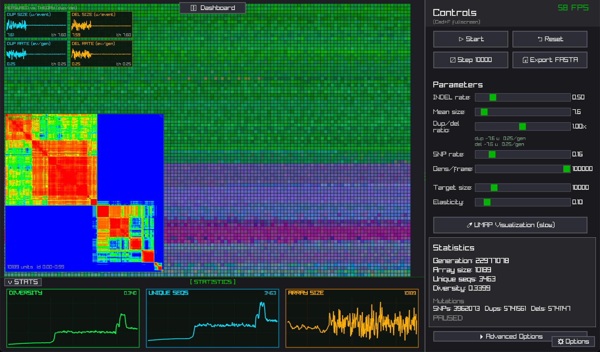
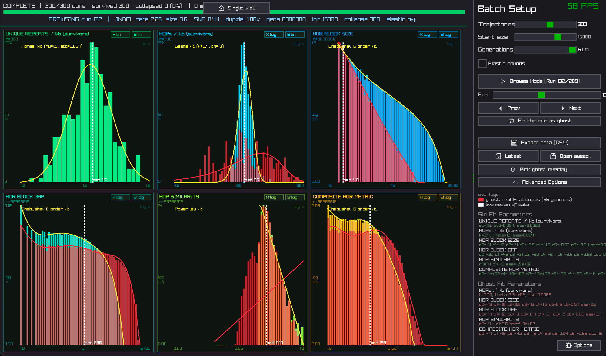

# CenSim

Interactive centromere evolution simulator. Watch satellite repeats mutate, duplicate, and delete in real-time.



## What is this?

Centromeres are regions of chromosomes made up of thousands of tandemly repeated DNA sequences. They evolve surprisingly fast through duplications, deletions, and point mutations. This simulator lets you watch that process happen.

Each colored tile represents a 178bp repeat unit. Similar sequences get similar colors, so you can see evolutionary patterns emerge as the array changes.

The model is based on the one described here: https://www.biorxiv.org/content/10.1101/2025.06.02.657473v1

## New in 1.1: Batch mode!

Watching a single array evolve is fun, but one run doesn't tell you much — evolution is noisy. So now you can flip to the **batch dashboard** and run hundreds of trajectories at once, watching the *distributions* of the summary metrics build up live: HORs per kb, block size, block gap, similarity, and a composite score. Each plot fits a curve as the data lands, so you get real numbers out, not just pretty shapes.



From there you can:

- **Sweep** a parameter across a range of runs and scrub back through the results
- **Overlay a ghost** — a past run, another sweep, or a *real* dataset — on top of the live plots, to see how close your simulation gets to actual centromere data
- **Export** everything to CSV and reopen old runs later

Flip between the single-array view and the batch dashboard with the toggle up top.

## Download

**macOS:** [CenSim.dmg](https://github.com/mbeavitt/censim-interactive/releases/latest/download/CenSim.dmg)

**Linux:** [CenSim-x86_64.AppImage](https://github.com/mbeavitt/censim-interactive/releases/latest/download/CenSim-x86_64.AppImage)

## Building from source

Requires raylib 5.x and premake5:

```bash
# macOS
brew install raylib premake

# Generate makefiles and build
premake5 gmake2
make -C build config=release

# Run
./bin/Release/censim
```

## Features

- **Real-time simulation** of repeat array evolution
- **Batch dashboard**: run hundreds of trajectories at once and watch their metric distributions (HORs/kb, block size, similarity…) build up live, with fitted curves
- **Parameter sweeps**: scan a parameter across runs and scrub through the results
- **Ghost overlays**: overlay a past run or a real dataset on the plots for direct comparison
- **Live statistics panel** showing diversity, unique sequences, and array size over time
- **UMAP visualization** for sequence similarity (requires Python with umap-learn)
- **Configurable mutation models**: Poisson, negative binomial, geometric, power law
- **Elastic bounding** to keep array size near a target
- **Export to FASTA / CSV** for downstream analysis

## Parameters

| Parameter | Default | Description |
|-----------|---------|-------------|
| INDEL rate | 0.5 | Expected duplications/deletions per generation |
| INDEL size | 7.6 | Expected repeat units per INDEL event |
| SNP rate | 0.1 | Expected point mutations per generation |
| Target size | 10000 | Target array size for elastic bounding |
| Elasticity | 0.1 | Pull strength toward target size |
| Dup/Del ratio | 1x | Size ratio of duplications to deletions (frequency coupled for zero net drift) |

## Controls

- **Single View / Batch**: switch between the live array and the multi-run dashboard (button up top)
- **Cmd+F** (macOS) / **F11**: Toggle maximize
- **Start/Stop**: Run or pause the simulation
- **Step N**: Advance N generations
- **Reset**: Start fresh
- **v STATS**: Toggle statistics panel

## How it works

**Coloring:** Each sequence is one-hot encoded (178bp × 4 bases = 712 dimensions), projected through an orthogonalized random matrix down to 3D, then normalized to RGB. Similar sequences → similar colors.

**Mutations:** Each generation, the simulator draws mutation counts from the selected distribution (Poisson by default), then applies them at random positions. Duplications copy a contiguous block; deletions remove one.

## License

MIT
